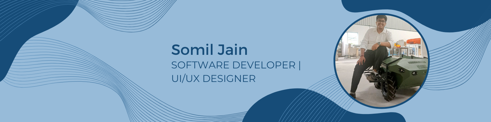

   

<h1 align="center">👋 Hello, I'm Somil Jain</h1>
<h3 align="center">🚀 Computer Science Enthusiast | Software Developer | UI/UX Designer</h3>

---

  
  
  
  
  
  
  
  
  

---

## 👨‍💻 About Me

- 🎓 **Education:** B.Tech Computer Science and Engineering @ VIT Bhopal (CGPA: 8.82/10, Sept’2022 – May’2026)
- 💡 **Passionate About:**  
  - AI-powered solutions, including **OCR**, **Smart Forecasting**, Data Analysis  
  - UI/UX Design with tools like **Figma**, **Canva**, **Photoshop**  
  - Developing impactful mobile and web applications
- 🌱 **Currently Learning:** DevOps, RDBMS, Spring Boot, Microservice Architecture, Big Data (Hive/Hadoop/Spark), Operating Systems[attached_file:1]

---

## 💼 Experience

- **AI DevOps Apprentice | DBS Tech India (Jun 2025 – Present)**
  - Structured training in Operating Systems, Application Security, MariaDB, Java, RESTful APIs, Spring Boot, Microservices, Big Data, and more
- **Software Engineer Intern | VE Commercial Vehicles Limited (Oct 2024 – Dec 2024)**
  - Developed Python/OpenCV system to extract and recognize cabin numbers from industrial images using EasyOCR (peak 91% accuracy)
  - Automated inspection for three different cabin types; built API integrations for seamless data transfer[attached_file:1]

---

## 🛠 Technical Skills

- **Programming Languages:** Python, C/C++, JavaScript, Matlab/R, HTML/CSS
- **Frameworks & Libraries:** Flask, FastAPI, Node.js, React, JQuery, Keras, Numpy, Pandas
- **Databases:** PostgreSQL, MongoDB, Firestore
- **Cloud/Tools:** AWS, Git, Linux, Windows, Figma, Canva, Photoshop[attached_file:1]

---

## 🚀 Projects

- **Dost-Bot | AI-Powered Journal Application**
  - React, FastAPI, Hugging Face, NLP, Sentiment Analysis
  - AI-driven journal app using Google FLAN-T5-large model for real-time emotional insights and personalized responses

- **RetailIQ | Smart Inventory Forecasting and Customer Retention**
  - Flask, Node.js, React, Machine Learning
  - ML-powered customer retention and inventory forecasting using Random Forest, XGBoost[attached_file:1]

---

## 🏆 Achievements

- 13th/500+ ZelestraXaws Data Challenge (Second Edition), among 7000+ participants
- Amdocs GenAI Graduate Hackathon (2024–25): Semi-Finalist, top 1% among 10,893 participants
- Cleared first rounds in Nokia’s Accelerate Her in Tech Hackathon, top ranks from 30,000+ participants[attached_file:1]

---

## 🌟 Additional Information

- Fluent English & Hindi communication
- Regular stock market analysis for investment insight and decision-making
- Model United Nations delegate, awarded High Commendation at CNMUN
- **UI/UX Lead, Android Club, VIT Bhopal:** Led a team of 4 UI/UX developers & 5 designers for college Android projects; mentored in best design practices[attached_file:1]

---

## 🌐 Connect With Me

  
  
  

---

⭐️ *"Striving to bridge the gap between innovation and reality with technology."*
